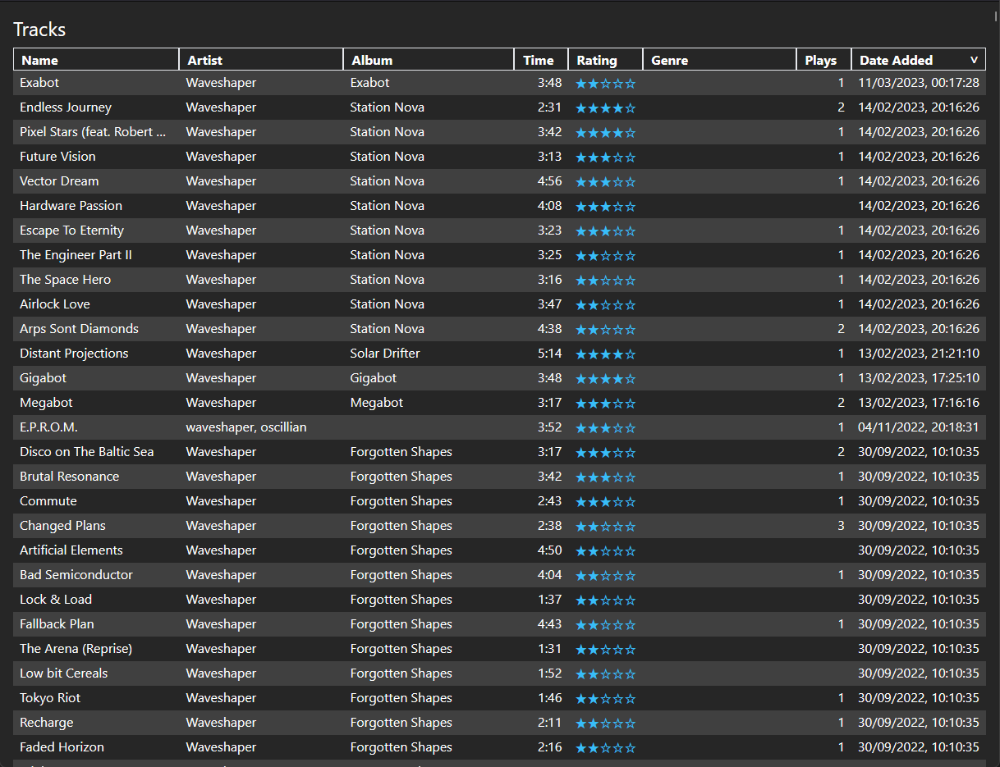

# Attuned

A personal project attempting to create an iTunes replacement.

The key requirements are:
- Cross compatibility with iTunes' library XML
- Ability to create playlists files from smart playlists for use on Android

Currently not even in alpha yet.

Huge kudos to [cvzi](https://github.com/cvzi)'s [itunes_smartplaylist](https://github.com/cvzi/itunes_smartplaylist) project, which I based the parsing code on.

Here's a picture of the early UI showing tracks loaded from my library.

## Tech stack

My first attempt at this project was with .NET Framework 4 and WinForms. Now I'm targeting .NET Core and working on a
WebAPI + React front-end.

## Development checklist

- [x] Decode XML into an in-memory data structure.
- [ ] Create a GUI to show this data. (Ongoing)
- [ ] Generate non-smart playlist files for Android.

## Not planned, potential features

- Media player
- Enable syncing files to Android.
- Write code to allow generation of XML file.
- Enable editing of track data via the GUI.
- Enable editing of smart playlists via the GUI